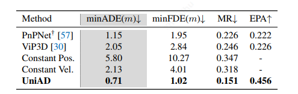
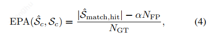
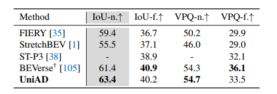
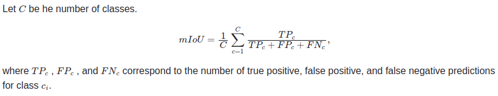
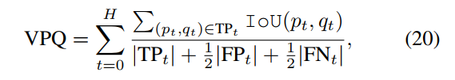

## Motion forecasting

### ADE（Average Displacement Error）

平均位置误差，预测车辆轨迹每个时刻位置与真实时刻位置的平均误差

​	ADE = 1/N * sum(sqrt((xi - x)^2) + (yi - y)^2)，N表示轨迹采样

### FDE（Final Displacement Error）

最终位移误差，预测车辆轨迹最终位置与真实最终位置之间的误差

​	FDE = sqrt((xf - x)^2 + (yf - y)^2)

minADE：对于N个预测轨迹，选择平均轨迹预测点预测误差最小的作为评估结果

minFDE：对于N个预测轨迹，选择终点预测误差最小的作为评估结果

### MR（Miss Rate）

漏检率：MR = FN/GT = 1 - TP/GT

### EPA（End-to-End Prediction Accuracy）

端到端预测精度。上面的评估指标中，计算正样本的距离误差，没有评估负样本（误检）情况，因此提出EPA。

c表示每一类别，N-GT表示gt个数，匹配是针对小于某一阈值的minFDE。

references：

1. ViP3D:Een-to-end Visual Trajectory Prediction via 3D Agent Queries   4.1partition

## Occupancy prediction

### mIoU

refenrences:

1. nuscenes dataset(https://www.nuscenes.org/)
2. https://github.com/CVPR2023-3D-Occupancy-Prediction/CVPR2023-3D-Occupancy-Prediction#evaluation-metrics

### VPQ(Video Panoptic Quality)

H表示连续帧

