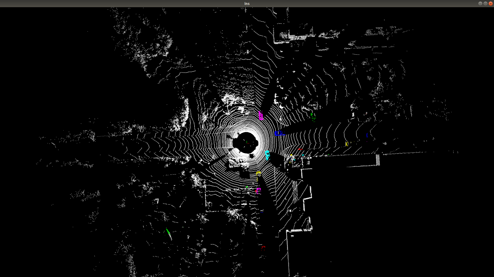

# CFNet

by ZhengHu on 5/9/2024

硬件环境：P4000

软件环境：ubuntu18.04、python3.8、pytorch1.10、cuda11.7、TenosrRT8.5

数据集：SemanticKITTI

推理显存占用：3525M

基于上述环境来分析CFNet模型的部署方案及可行性，本篇分析仅在pytorch上测试，仅供参考。

## 网络构架

论文使用PolarNet和CPGNet两种backbone来提取不同视角的特征，在指标方面CPGNet比PolarNet高出2个点左右，实验中以CPGNet为例作为backbone进行分析，代码中同是以此为例。

下图CFFE子模块可视化：

## 指标复现

情景一：

当按照baseline超参设置学习率为0.005时，训练到8个epoch时出现了loss为nan情况。当时没有使用TensorBoard，只能通过打印分析。

情景二：

这边进行了超参调整减小学习率（0.001）达成相关评估指标，当训练到最后一个epoch时loss会稍微上升，评估指标以倒数第二个epoch模型为测试基础，相关指标相差无几。

|          | lr    | epoch | gpus | bs   | PQ           | mIOU         |
| -------- | ----- | ----- | ---- | ---- | ------------ | ------------ |
| baseline | 0.02  | 48    | 8    | 2    | 62.7         | 67.4         |
| own      | 0.001 | 70    | 4    | 1    | 62.9（+0.2） | 67.2（-0.2） |

但是，在学习率局部不变的情况下，loss会出现跳动

情景三：

优化训练实验，增加clip grad，训练未出现异常，loss曲线如下：

训练之后评估指标，训练70个epoch之后PQ值上升，mIOU下降，可能是由于过拟合导致。

下标第2项实验调整学习率训练结束，评估指标PQ、mIOU均有所提升。

| item | exp                | lr      | epoch | gpus | bs   | PQ           | mIOU         | Note                  |
| ---- | ------------------ | ------- | ----- | ---- | ---- | ------------ | ------------ | --------------------- |
| 0    | baseline           | 0.02    | 48    | 8    | 2    | 62.7         | 67.4         |                       |
| 1    | own_clip(epoch_69) | 0.00125 | 70    | 4    | 1    | 63.4（+0.7） | 65.5（-1.9） | add clip for gradient |
| 2    | own_clip(epoch_69) | 0.001   | 70    | 4    | 1    | 64.8（+2.1） | 68.4（+1.0） | add clip for gradient |

## 代码分析

### 模型

代码中分别在RV、BEV视角提取特征，然后在不同的分支（sem、ins）上进行特征融合；采用通用的分割分支加实例分支方式，实例分支回归score+offset特征用于后处理实例化。模型中各子模块及其耗时如下：

| submodule                  | time cost（s） | note                                        |
| -------------------------- | -------------- | ------------------------------------------- |
| point_pre                  | 0.027          | 点云特征升维处理（7 channels->64 channels） |
| rv_net                     | 0.026          | rv视角的backbone                            |
| bev_net                    | 0.037          | bev视角的backbone                           |
| fusion                     | 0.055          | CFFE模块中融合两个视角的sem&ins分支         |
| reproj_with_offset（cuda） | 0.007          | 根据offset重新计算点坐标，cuda操作          |
| rv_FEM+bev_FEM             | 0.022          | FEM submodule on each view（RV、BEV）       |
| head(fusion)               | 0.017          | 融合两个视角下的特征                        |
| VoxelMax(cuda)             | 0.006          | cuda operation                              |
| **total**                  | **0.201**      | 模型总耗时                                  |

### 后处理

形式上采用常规聚类方式，但是本篇论文给出了两个实例特征offset和score。一方面根据score能够过滤掉大部分点云，根据配置档参数只用对4.5%的点进行操作；另一方面offset参数重新映射点云的坐标位置，更好的减小实例分割误差。

### 嵌入式部署

代码层面包含三种操作：常规卷积、VoxelMax、OffsetReproject；在部署阶段常规卷积可转换engine模型，VoxelMax & OffsetReproject需要采用TensorRT plugin方式实现。

上述模型耗时仅在P4000硬件测试，后续开展嵌入式耗时测试方便开展针对性耗时优化；必要时可采用模型量化方式。

## 推理可视化

| segmentation |  |
| ------------ | -------------------- |
| instance     |  |

